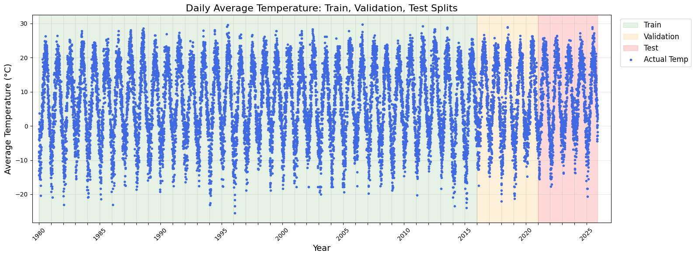
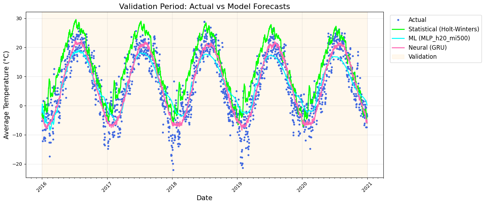
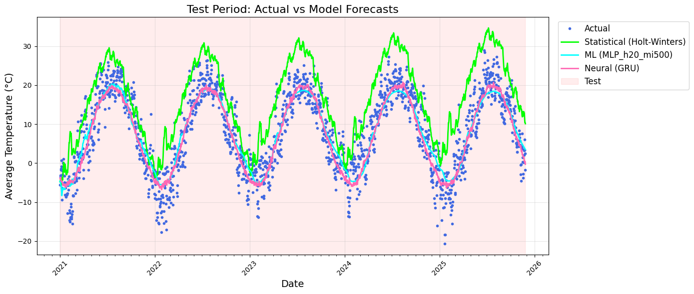
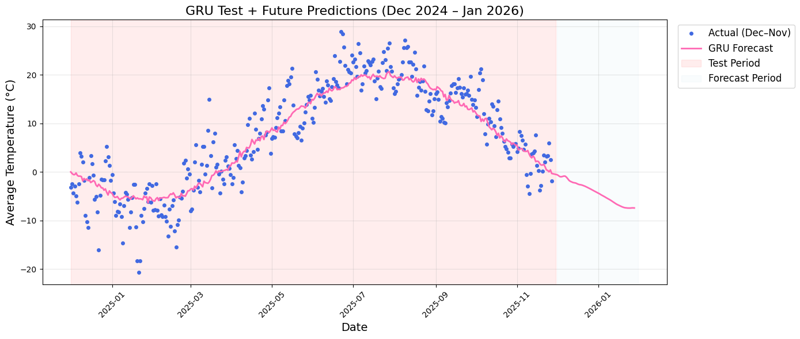

# *Time Series Forecasting of Daily Temperature in Michigan*

**TIS3IL-WS25-Project – Documentation**

---
# Project Summary

---

## **1. Business Problem**

Develop a robust, reproducible pipeline to forecast daily average temperature (`tavg`) in Michigan (1980–2025). Accurate forecasts support energy demand planning, load balancing, and risk management. The task is a univariate, long-horizon time series problem with strong seasonality, trends, short-term dependencies, and potential non-linear dynamics. Multiple model families are evaluated to balance accuracy, robustness, and operational complexity.

---

## **2. Data Engineering and Preparation**

**Data Source:** Meteostat Bulk API (central Michigan), 1980–2025, includes temperature, precipitation, snow, wind, pressure, and sunshine.  
**Processing:** Station aggregation → daily series → missing values imputed via climatology → cleaned dataset saved as `processed_weather_data_michigan.csv`  
**Split:**

* Training: 1980–2015
* Validation: 2016–2020
* Test: 2021–2025

Shared splitting function ensures reproducibility across notebooks.

---

## **3. Feature Engineering**

* **Baseline & Statistical:** raw univariate series
* **Machine Learning (MLForecast):** lag features, rolling windows, differencing
* **Neural (NeuralForecast):** 365-day input windows, full sequences, automatic feature learning

---

## **4. Model Training**

## 4. Model Training

| Category | Models / Methods |
|----------|------------------|
| Baseline | Naïve, Seasonal Naïve, Historical Average, Drift, Structural Trends |
| Statistical | SES, Holt, Holt-Winters, AR, MA, ARIMA |
| Machine Learning | Linear, Ridge, Huber, KNN, Decision Trees, Random Forest, Gradient Boosting, LightGBM, XGBoost, SVR, MLP |
| Neural | RNN, LSTM, GRU, NBEATS, NHITS|

---

## **5. Evaluation and Model Selection**

**Metrics:** MAE, RMSE, MAPE (interpreted cautiously)  
**Findings:**

* Baselines perform poorly long-term
* Statistical models capture seasonality but smooth extremes
* ML improves accuracy but plateaus
* GRU achieves lowest MAE/RMSE, best temporal alignment

---

## **6. Top Models Visualization**

[Visualization notebook](../../code/03-visualization.ipynb) compares best models: baseline, statistical, ML, GRU.

**Plots:**

1. Full historical series (1980–2025) – context and seasonal patterns
2. Validation period – forecasts vs actuals
3. Test period – forecasts vs actuals

**Observations:**

* Baseline lags seasonal transitions
* Statistical smooths extremes
* MLP reacts faster but may overfit
* **GRU aligns closely with actuals**

**Best Models per Family:**

| Family      | Model                    | Reason                                                         |
| ----------- | ------------------------ | -------------------------------------------------------------- |
| Baseline    | Seasonal naïve           | Simple reference, captures annual cycles                       |
| Statistical | Holt-Winters             | Seasonal modeling, linear trends                               |
| ML          | MLP (h20)                | Captures short-term dependencies and non-linear patterns       |
| Neural      | GRU_h1792_in_365_enc64x2 | Lowest test MAE (3.50), RMSE (4.44), robust seasonal alignment |

---

## **7. Final Model Selection**

**GRU neural network** selected based on MAE/RMSE, residual diagnostics, and visual comparison.

**Forecast Composition:**

1. Retrain GRU on training + validation data
2. Generate rolling forecasts for the test horizon
3. Visualize predictions with historical data

GRU provides **robust, interpretable, and accurate long-horizon forecasts** suitable for downstream operational use.

---

# Detailed Project Documentation

## **1. Business Problem**

The objective of this project is to develop a robust and reproducible time-series forecasting pipeline for daily average temperature (`tavg`) in Michigan using historical weather observations from 1980 to 2025. The primary business motivation is to provide reliable temperature forecasts as an upstream input for downstream energy demand forecasting conducted by external companies.

Accurate temperature forecasts are a critical dependency for organizations operating in energy generation, distribution, and trading, where temperature fluctuations directly influence heating and cooling demand, load balancing, capacity planning, and risk management. Errors at the temperature forecasting stage propagate into demand forecasts, increasing operational costs and planning uncertainty.

The forecasting task is formulated as a univariate time-series prediction problem with a long forecasting horizon, requiring models capable of capturing:

* pronounced annual seasonality
* long-term climatic trends
* short-term temporal dependencies
* potentially non-linear dynamics

To ensure methodological rigor and suitability for industrial reuse, multiple model families are evaluated-ranging from simple statistical baselines to advanced machine learning and deep learning architectures-and compared within a consistent and standardized evaluation framework. This approach enables downstream users to select models that best balance accuracy, robustness, and operational complexity for energy demand forecasting applications.

---

## **2. Data Engineering and Preparation**

### **Data Source**

Daily weather data are retrieved from the **Meteostat Bulk API**, using a geographic point representing central Michigan. The raw dataset spans **1980-01-01 to 2025-11-30** and includes the variables:

* average, minimum, and maximum temperature
* precipitation
* snow
* wind speed and pressure
* sea level air pressure
* sunshine duration

The modeling target is daily average temperature (`tavg`).

### **Station Selection and Aggregation**

Nearby weather stations are identified using the Meteostat `Stations().nearby()` function. Daily weather observations are then aggregated spatially through the Meteostat `Daily(Point)` interface, yielding a single continuous time series.

### **Data Cleaning and Imputation**

The raw dataset contains missing values, particularly in early years and auxiliary variables. The preprocessing notebook performs:

* temporal alignment and indexing
* missing value inspection
* imputation using climatological averages and vectorized operations

The cleaned dataset is exported as
`processed_weather_data_michigan.csv` and serves as the single source of truth for all downstream notebooks.

For a more detailed discussion of the data and preprocessing steps, [see the detailed prepocessing documentation](doc_preprocessing.md).

---

## **3. Train / Validation / Test Splitting**

All modeling notebooks (baseline, statistical, ML, neural) rely on a shared [shared splitting function](../../code/splitting.ipynb) (`split_time_series`) to guarantee consistency and prevent data leakage.

The time-based split is defined as:

* **Training:** 1980-01-01 → 2015-12-31
* **Validation:** 2016-01-01 → 2020-12-31
* **Test:** 2021-01-01 → 2025-11-30

---

## **4. Feature Engineering**

Feature engineering differs by model family:

### **Baseline & Statistical Models**

* operate directly on the raw univariate series
* no explicit feature generation

### **Machine Learning Models**

Implemented using **`mlforecast`**, which converts the time series into a supervised learning problem:

* lag features of `tavg`
* differencing to stabilize the series
* time-aware rolling windows

This approach enables standard regressors (e.g., Random Forest, XGBoost) to learn temporal dependencies.

### **Neural Models**

NeuralForecast models consume:

* fixed-length input windows (365 days)
* full sequence history without manual feature construction

---

## **5. Model Training**

### **5.1 Baseline Models**

Implemented in [baseline models](../../code/02-baseline.ipynb), including:

* Naïve forecast
* Historical average
* Seasonal naïve
* Random walk with drift
* Structural local trend models

Baselines establish lower performance bound and provide interpretability. These are selected to establish reference performance levels, highlighting the minimum achievable accuracy and providing interpretability for downstream comparisons.

---

### **5.2 Statistical Models**

Implemented in [statistical models](../../code/02-stats-models.ipynb) using `statsmodels`:

* Simple Exponential Smoothing (SES) - chosen for short-term smoothing and trend capturing
* Holt linear trend - selected to capture linear trends over time
* Holt-Winters seasonal model  - used for explicitly modeling strong annual seasonality
* AR, MA, and ARIMA models - chosen to model autocorrelations and short-term dependencies

---

### **5.3 Machine Learning Models**

Implemented in [machine learning models](../../code/02-ml-models.ipynb), covering:

* Linear, Ridge, Huber, Tweedie regression - baseline ML with interpretable coefficients
* KNN and Radius Neighbors - non-parametric, capturing local patterns
* Decision Tree and Random Forest - nonlinear patterns and interactions
* Gradient boosting, LightGBM, XGBoost - high-performance tree-based models for complex dependencies
* Support Vector Regression - robust to outliers and small-scale structure
* MLP Regressor - feedforward neural baseline capturing nonlinearities

These models are chosen to explore nonlinear temporal patterns and complement statistical approaches.

---

### **5.4 Neural Forecasting Models**

Implemented in [neural forecasting models](../../code/02-neural-models.ipynb) using Nixtla NeuralForecast:

* LSTM - selected for longer-term dependencies with gating mechanisms
* GRU - chosen for efficient long-term sequence modeling with superior performance
* RNN - simple recurrent modeling of sequential dependencies
* NBEATS/NHITS - state-of-the-art architectures for interpretable trend/seasonality decomposition

Models are trained with:

* 365-day input windows
* MAE loss
* fixed random seeds for reproducibility

Neural models are designed to learn complex, nonlinear temporal dynamics directly from raw sequences

---

## **6. Evaluation and Model Selection**

### **Metrics**

All models are evaluated using a shared [evaluate_and_save() function](../../code/metrics.ipynb) function, producing:

* MAE
* RMSE
* MAPE (used cautiously due to near-zero temperatures).

Results are saved to CSV files per model family and loaded centrally for comparison.

### **Comparative Results**

**Model Performance Summary**
- from saved csv files for all model families: [baseline performance](../../data/models/baseline_results.csv), [statsmodels performance](../../data/models/statsmodels_results.csv), [ml models performance](../../data/models/ml_models_results.csv) and [neural models performance](../../data/models/neural_models_results.csv)

Key findings:
* Baselines perform poorly on long horizons
* Statistical models capture seasonality but struggle with extremes
* Tree-based ML models improve accuracy but plateau
* GRU neural model consistently achieves the lowest MAE and RMSE

---

## **7. Top Models Visualization and Comparative Analysis**

To complement the numerical evaluation, the [visualization notebook](../../code/03-visualization.ipynb) is used to visually compare the best-performing model from each model family:

Three main plots:
- full historical series (1980–2025) - context and seasonal patterns
- validation period - actual vs. forecast
- test period – actual vs. forecast

Observations:
- baseline models lag behind seasonal transitions
- statistical models capture seasonality but smooth extremes
- MLP reacts faster but may overfit short-term fluctuations
- GRU aligns closest to actual temperatures across periods

Visualization supports quantitative evaluation and highlights temporal consistency.

### **Objective of the Visualization Notebook**

The notebook has three explicit goals:

1. visualize entire historical temperature series
2. compare model forecasts against actual values in the validation period
3. compare model forecasts against actual values in the test period

This approach ensures that model selection is not based solely on aggregate error metrics but also on temporal consistency and realism of forecasts.

---

### **7.1 Best Model per Family**

The best-performing models are selected based on validation and test MAE/RMSE, interpretability, and stability:

| Model Family         | Selected Model           | Reason for Selection                                                                                                                                           |
| -------------------- | ------------------------ | -------------------------------------------------------------------------------------------------------------------------------------------------------------- |
| **Baseline**         | Seasonal naïve           | captures repeating annual cycles with minimal complexity, provides a reference performance level.                                                              |
| **Statistical**      | Holt-Winters             | explicitly models seasonality, best linear approximation for validation/test MAE.                                                                             |
| **Machine Learning** | MLP (h20 variants)       | uses lagged features and rolling windows to capture short-term dependencies and nonlinear patterns, lowest MAE among ML models                                |
| **Neural Network**   | GRU_h1792_in_365_enc64x2 | directly learns complex temporal dynamics from raw sequences, achieves lowest test MAE (3.50) and RMSE (4.44) and robust alignment with seasonal patterns |

This selection ensures that each family’s best representative is included in the comparison, highlighting performance improvements across approaches.

---

### **7.2 Visualization Design**

#### **7.2.1 Full Series Plot (1980–2025)**

The full historical temperature series provides a contextual baseline for evaluating model forecasts. Observed patterns include:

* highly consistent annual seasonality
* slightly increasing variance in recent decades
* occasional extreme events (heatwaves, cold periods)

Top models are overlaid on this series in the following plots to examine long-term trend adherence and seasonal pattern alignment. The GRU model closely follows seasonal cycles without smoothing critical variations, whereas baseline and statistical models may lag or underrepresent extremes.

#### **7.2.2 Validation Period Comparison (2016–2020)**

This plot overlays the actual observed temperatures with forecasts from each top model:

* **Baseline:** predictable seasonal pattern but significant lag at seasonal turning points
* **Statistical (Holt-Winters):** captures overall seasonality but smooths peaks and troughs
* **MLP:** reacts faster to short-term deviations but can show minor overfitting in sharp transitions.
* **Neural: GRU:** closest alignment with actual temperatures, minimal lag - preserves amplitude of seasonal extremes

#### **7.2.3 Test Period Comparison (2021–2025)**

The test period visualizations reveal true out-of-sample performance:

* **Baseline forecasts** diverge quickly from actual observations due to inability to adapt to interannual variability
* **Statistical models** underestimate extreme events and may oversmooth seasonal transitions
* **MLP forecasts** show slight variance amplification but capture short-term trends better than statistical models
* **GRU forecasts** remain stable and accurate throughout, particularly at seasonal turning points (spring/fall transitions), confirming strong generalization

These plots demonstrate that GRU outperforms all other approaches not just in MAE/RMSE but also in realistic temporal behavior, a critical requirement for energy and operational planning.

---

## **8. Final Model Selection and Forecast Composition**

Based on:

* lowest validation and test MAE/RMSE
* residual diagnostics
* cross-family visual comparison

the GRU neural network is selected as the final forecasting model.

The final forecast is produced by:

1. retraining the GRU on training + validation data
2. generating rolling forecasts for the test horizon
3. visualizing predictions alongside historical observations

---
